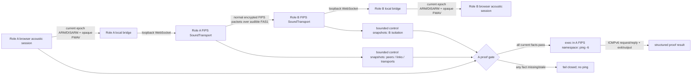

# Phase 4: Prove the Sound-Only FIPS Ping - Research

**Researched:** 2026-07-24
**Domain:** Authenticated FIPS Sound peer, isolated-role proof, and kernel ICMPv6 acceptance
**Confidence:** HIGH

## User Constraints (from CONTEXT.md)

### Locked Decisions

**D-01:** Normal upstream FIPS authentication, link encryption, handshake, heartbeat, and reconnect machinery must be reused unchanged; there is no demo-only peer protocol or pre-authenticated bypass.

**D-02:** A Sound peer may enter the FIPS connection lifecycle only when the current acoustic session has a matching committed settings digest, `COMMIT_ACK`, and a current heartbeat. Worker-up, browser-connected, and audio preflight remain insufficient. — **Reversibility:** costly — changing this boundary later would touch the browser, bridge, Rust transport, peer state machine, and evidence contract.

**D-03:** Acoustic invalidation disarms packet admission before FIPS observes link loss. Re-authentication after recovery must use the normal FIPS peer lifecycle and current acoustic epoch; stale peer or browser work cannot restore the link.

**D-04:** Role B's generated FIPS configuration contains Sound as its only transport and the configured A identity as its only demo peer address. Runtime inspection—not configuration text alone—must prove that no UDP, TCP, Ethernet, Tor, Nym, BLE, or alternate FIPS transport is active or usable.

**D-05:** Browser and FIPS bridge endpoints remain inside each laptop and bind only to loopback. They may never become an inter-laptop packet path. Docker service-namespace sharing remains a local implementation detail.

**D-06:** Role A is the participant/wider-mesh side. It may use an existing supported FIPS transport for upstream mesh access when the target environment provides one, but the A↔B peer address is Sound only and role selection must be sufficient to choose the configuration. Exact upstream transport selection and host discovery are the planner's discretion; no new required operator parameter may be introduced.

**D-07:** The disposable A/B identities and deterministic `fips0` IPv6 addresses may remain fixed for this demo. Private nsecs stay in the secret-bearing generated config and never enter browser/public status.

**D-08:** The acceptance ping originates from the Linux kernel in role A's real FIPS container/network namespace and targets role B's deterministic `fips0` IPv6 address. The system `ping -6` process, real ICMPv6 request/reply, exit status, sequence, latency, and packet-loss output are authoritative.

**D-09:** A browser event, synthetic ICMP payload, direct WebSocket echo, unit fixture, or host-network ping cannot satisfy the acceptance proof. Fixture tests may validate orchestration only and must remain labelled `Fixture`.

**D-10:** The ping command must fail closed unless the current authenticated FIPS peer is bound to Sound, the acoustic session is ready in the same epoch, role B's isolation proof passes, and the target address matches the configured B identity.

**D-11:** One bounded normal recovery path handles a browser/acoustic interruption: disarm, expose degraded state, recover/recalibrate if allowed, re-establish the authenticated peer, then permit a new ping. There is no hidden process restart or alternate transport failover.

**D-12:** Phase 4 exposes structured runtime facts for authenticated peer, Sound transport, active link, B isolation, acoustic TX/RX, complete-packet/fragment/integrity/retry counters, and ICMPv6 outcome. Counters advance from observed events only; UI inference is prohibited.

**D-13:** Evidence classes remain strict: deterministic orchestration is `Fixture`, one-machine physical speaker/microphone is `Loopback`, and only two named machines with matching records may be `Open air`. Missing physical hardware produces `human_needed`, never a fabricated pass.

**D-14:** Phase 4 needs one successful request/reply acceptance proof and one bounded interruption/reconnect proof. Ten consecutive exchanges, three cold starts, 60-second rehearsal scoring, and presenter choreography are Phase 5.

### the agent's Discretion

- Choose the smallest existing FIPS control/snapshot seam that can expose authenticated peer identity, link/transport, and counters without parsing logs as the primary contract.
- Run the role-A kernel ping from the bridge runner's proof controller, which shares the FIPS service network namespace under Compose; invoke the fixed system binary directly with bounded arguments so no host route or separate proof service becomes authoritative.
- Choose the existing FIPS upstream transport for optional wider-mesh access on role A after researching Docker Desktop/macOS and Linux compatibility.

### Deferred Ideas (OUT OF SCOPE)

- One-command full-stack launcher and role-only CLI polish — Phase 5.
- No-scroll presentation screens and Debug mode — Phase 5.
- Ten consecutive pings, three cold starts, final 60-second recovery score, evidence-directory freeze, documentation, and presenter script — Phase 5.
- Multiplexed acoustic connections and near-ultrasonic profiles — later milestone.

## Project Constraints (from AGENTS.md)

- Preserve the real-kernel, bidirectional IPv6 ping proof; do not substitute a UI or application echo. [VERIFIED: AGENTS.md]
- Keep role B offline except for its FIPS Sound transport; browser audio remains browser-owned and FIPS remains containerized. [VERIFIED: AGENTS.md]
- Preserve a FIPS-facing MTU of at least 1357 bytes and keep fragmentation/reassembly below FIPS. [VERIFIED: AGENTS.md]
- Target macOS/macOS and macOS/Linux with Docker plus Chromium-class browsers. [VERIFIED: AGENTS.md]
- Use the codebase knowledge graph first for code discovery; use textual search only for configuration/string evidence or when the graph is insufficient. [VERIFIED: AGENTS.md]
- Do not make direct repository edits outside an active GSD workflow. [VERIFIED: AGENTS.md]

## Phase Requirements

| ID | Description | Research Support |
|---|---|---|
| FIPS-04 | Static Sound peers perform normal authenticated encrypted handshake. | Gate normal FIPS dialing on existing `SoundTransport::connection_state`; prove through the bounded `show_peers` control snapshot that expected npub is authenticated and `transport_type` is `sound`. [VERIFIED: repository source] |
| FIPS-05 | Normal heartbeat and bounded reconnect after acoustic/browser interruption. | Keep existing FIPS peer `auto_reconnect`; prove disarm → peer loss/retry → fresh authenticated Sound link, without restarting either daemon. [VERIFIED: repository source] |
| DEPLOY-03 | B has no usable FIPS transport except Sound. | Generated B YAML must contain only `transports.sound`; live `show_transports` must have exactly one Sound instance. [VERIFIED: repository source] |
| DEPLOY-04 | A connects Sound peer to wider mesh/participant side. | Make Role A's Wi-Fi UDP client posture optional and non-required; its configured B peer remains Sound-only. [VERIFIED: repository source] |
| DEPLOY-05 | Browser bridge cannot be another laptop-to-laptop path. | Keep Compose publish on `127.0.0.1`, FIPS un-published, shared service namespace; inspect this live. [VERIFIED: repository source] |
| DEMO-01 | Real `ping -6` originates from participant side. | A's bridge runner executes the system `ping -6` directly inside its Compose-shared FIPS network namespace and records exact stdout/stderr/exit status. [CITED: https://man7.org/linux/man-pages/man8/ping.8%40%40iputils.html] |
| DEMO-02 | B returns real kernel echo reply via Sound. | Require ICMPv6 success only after the Sound-authenticated FIPS peer/link evidence passes; correlate before/after counters. [VERIFIED: repository source] |
| DEMO-03 | Show peer/transport/link/isolation before ping. | Use FIPS control socket `show_peers`, `show_links`, and `show_transports`, not daemon logs. [VERIFIED: repository source] |
| DEMO-04 | Correlate acoustic, packet, integrity/retry, and ICMP counters. | Combine observed browser acoustic snapshot, bridge packet counters, FIPS control snapshots, and process result in a timestamped proof object. [VERIFIED: repository source] |
| CONFIG-04 | A permits Wi-Fi-side FIPS path; B permits only local boundary plus Sound. | Extend the single `resolveDemoConfig`/`renderFipsConfig` authority with role-specific transport policy. [VERIFIED: repository source] |

## Summary

Phase 3 already establishes the necessary admission boundary. `AcousticSessionAdapter.refresh()` arms the FIPS packet adapter only from a current ready session, while degradation/reset first sends `ACOUSTIC_DISARM`; the bridge and vendored `SoundTransport` then reject packets until a valid current-epoch arm proof arrives. Phase 4 must leave that boundary intact and let ordinary FIPS handshake traffic flow only after it is armed. [VERIFIED: repository source]

The vendored FIPS control socket is the smallest trustworthy observability seam. Its `show_peers` query reports authenticated npub, connectivity, link ID, transport type, and link counters; `show_links` reports the active link and counters; `show_transports` reports every instantiated transport and Sound's worker/readiness/counter projection. This is a live snapshot rather than a log-derived inference. [VERIFIED: repository source]

The current bridge runtime image is missing `iputils-ping`. Phase 4 installs that Debian package there and adds a bounded Node client for the vendored FIPS Unix control socket; it does not build or copy `fipsctl`. The Compose bridge and FIPS services already share one network namespace, and a private Compose volume exposes `/run/fips/control.sock` to the bridge without publishing it to the host. The runner-owned proof controller can therefore read current FIPS control snapshots and execute the system `ping -6` in that same live namespace without creating another host or browser path. [VERIFIED: repository source]

**Primary recommendation:** Add a runner-owned `ProofController` injected into `createBridgeServer`. The existing listener serves exact same-origin `GET /proof-status` and `POST /proof-ping`; it owns fresh FIPS/acoustic/topology joins, the in-band B-isolation challenge, and one bounded system ping. After normal FIPS/Sound authentication, A sends a cryptographically random one-use IPv6 UDP challenge from A's `fips0` address to a fixed B `fips0` proof port. A Role B responder sharing the FIPS network namespace returns an exact-schema isolation attestation over that same authenticated/encrypted FIPS/Sound path. Only a current matching response can enable ping. [VERIFIED: repository source] [VERIFIED: locked planner resolution] [CITED: https://man7.org/linux/man-pages/man8/ping.8%40%40iputils.html]

## Architectural Responsibility Map

| Capability | Primary Tier | Secondary Tier | Rationale |
|---|---|---|---|
| Acoustic readiness and invalidation | Browser / Client | Local bridge | Browser owns acoustic session; bridge/Rust accept only its current capability projection. [VERIFIED: repository source] |
| Packet admission and normal FIPS authentication | API / Backend | Browser / Client | Sound transport gates opaque packets, while FIPS owns Noise handshake, encryption, heartbeat, and peer lifecycle. [VERIFIED: repository source] |
| Authenticated peer/link/transport facts | API / Backend | — | FIPS control snapshots are the authoritative runtime source. [VERIFIED: repository source] |
| B Sound-only proof | API / Backend | Docker runtime | FIPS snapshot proves instantiated transports; Compose inspection proves local endpoint/capability boundary. [VERIFIED: repository source] |
| In-band B isolation attestation | API / Backend | FIPS/Sound data plane | Role B snapshots locally, then returns a nonce-bound exact-schema attestation over an IPv6 UDP exchange carried by the already-authenticated encrypted FIPS/Sound link. [VERIFIED: locked planner resolution] |
| Kernel ICMPv6 acceptance | API / Backend | Database / Storage | System `ping` runs in A's FIPS namespace; immutable proof record retains observed result. [VERIFIED: repository source] |
| Display of proof facts | Browser / Client | API / Backend | The browser renders structured facts supplied by the bridge; it must not derive peer/ping success itself. [VERIFIED: repository source] |

## Standard Stack

### Core

| Library / tool | Version | Purpose | Why Standard |
|---|---|---|---|
| Vendored FIPS Unix control socket + bounded Node client | vendored `fc8ebd5` base | Read authenticated peer, link, and transport snapshots. | Existing read-only control queries already expose exactly the required facts; a strict Node client avoids shipping another control binary or listener. [VERIFIED: repository source] |
| Vendored `SoundTransport` | vendored `fc8ebd5` base | Admission gate, local bridge worker, bounded reconnect, transport counters. | It already fails closed when not armed and publishes Sound-specific counters through `show_transports`. [VERIFIED: repository source] |
| `iputils-ping` | Debian Bookworm package | Authoritative Linux kernel ICMPv6 request/reply process. | The existing image is Debian Bookworm; `ping -6`, `-c`, `-W`, and exit semantics are documented by iputils. [VERIFIED: repository source] [CITED: https://man7.org/linux/man-pages/man8/ping.8%40%40iputils.html] |
| Node built-ins (`node:net`, `child_process.execFile`) | Node 22.23.1 runtime | Bounded Unix-socket observation and proof orchestration. | The pinned bridge runtime provides both APIs; strict request allowlisting and argument arrays avoid a shell or generic control surface. [VERIFIED: repository source] |

### Supporting

| Tool | Purpose | When to Use |
|---|---|---|
| Docker Compose + `docker inspect` | Verify namespace, publication, capabilities, and actual FIPS process. | Before every live B-isolation proof. [VERIFIED: repository source] |
| Existing `/bridge-status` + acoustic public status | Local observed bridge/acoustic counters and epoch. | Correlate FIPS snapshots with real local browser session state; never use it as peer-auth authority. [VERIFIED: repository source] |

### Alternatives Considered

| Instead of | Could Use | Tradeoff |
|---|---|---|
| FIPS control snapshots | Daemon-log parsing | Logs are existing smoke diagnostics but cannot reliably establish current authenticated/link/transport state. Do not use as primary contract. [VERIFIED: repository source] |
| Runner-owned proof controller in the Compose-shared FIPS network namespace | Host `ping` or a host-side `docker exec` orchestrator | Docker Desktop cannot route host traffic to Linux containers and per-container addressing is unavailable; either host-side approach weakens the locked namespace authority and lifecycle ownership. [CITED: https://docs.docker.com/desktop/features/networking/networking-how-tos/] |
| Default B Sound-only config | Host networking | Host mode removes normal network isolation and is platform-specific/opt-in on Docker Desktop; it is not needed for the local bridge architecture. [CITED: https://docs.docker.com/engine/network/drivers/host/] |

**Installation / image change:**

```dockerfile
# Dockerfile.bridge — final runtime stage
RUN apt-get update \
  && apt-get install -y --no-install-recommends iputils-ping \
  && rm -rf /var/lib/apt/lists/*
```

No new npm, crates.io, or PyPI dependency is required. [VERIFIED: repository source]

## Package Legitimacy Audit

No third-party application package is introduced by this phase. The control client uses Node built-ins, and `iputils-ping` is an OS package from the pinned Debian image's configured package source. [VERIFIED: repository source]

## Architecture Patterns

### System Architecture Diagram



The only inter-laptop edge is the encrypted FIPS packet path carried by the browser's audible FAS1 path. Browser WebSockets and FIPS control sockets are local-only. [VERIFIED: repository source]

### Recommended Project Structure

```text
packages/bridge/src/
├── demo-config.ts       # Extend the one role/config authority
├── fips-control-client.ts # Bounded LF-delimited JSON client for /run/fips/control.sock
├── runner.ts            # Instantiate/own proof controller and Role B responder
├── server.ts            # Exact same-origin /proof-status and /proof-ping routes
├── proof.ts             # Pure snapshot validation / proof-result schema
├── proof-controller.ts  # Current-state admission, challenge, ping, lifecycle
└── isolation-attestation.ts # Exact bounded UDP challenge/response contract
packages/bridge/test/
├── fips-control-client.test.ts
├── proof-controller.test.ts
└── isolation-attestation.test.ts
scripts/
└── fips-compose-smoke.mjs # Extend live isolation/topology assertions
tests/
├── production-runner.test.ts # Controller injection/ownership/routes
└── fips-compose.test.mjs # Role B topology/config mutation assertions
Dockerfile.bridge        # Install iputils-ping in the final bridge runtime
```

### Pattern 1: Snapshot join with an explicit freshness/identity gate

**What:** Obtain one bounded local `show_transports`, `show_peers`, and `show_links` snapshot; validate their joins by expected npub, `sound` transport type, shared link ID, configured Sound address, and current acoustic epoch before exposing `pingReady`. [VERIFIED: repository source]

**When to use:** Before each ping and after recovery; never cache a pre-interruption positive result. [VERIFIED: repository source]

**Example:**

```typescript
// Repository sources: vendor/fips/src/control/queries.rs, packages/bridge/src/demo-config.ts
const sound = transports.transports.filter((t) => t.type === 'sound');
const peer = peers.peers.find((p) => p.npub === config.fips.expectedPeerPublicKey);
const link = peer && links.links.find((l) => l.link_id === peer.link_id);
const ready = sound.length === 1
  && sound[0].state === 'up'
  && sound[0].stats.acoustic_ready === true
  && peer?.connectivity === 'connected'
  && peer.transport_type === 'sound'
  && link?.transport_id === sound[0].transport_id
  && acoustic.ready === true
  && acoustic.epoch === sound[0].stats.epoch;
```

### Pattern 2: Runner-owned controller separates admission from the authoritative ping

**What:** `runner.ts` instantiates one `ProofController`, injects it into `createBridgeServer`, and registers its shutdown handle with `ResourceOwner`. `GET /proof-status` is read-only; `POST /proof-ping` accepts only same-origin exact empty JSON on Role A. The controller refreshes every prerequisite, completes the in-band B-isolation challenge, then invokes the system ping with an `execFile` argument array in the Compose-shared FIPS network namespace. It records the unmodified output and exit result. There is no second HTTP listener. [VERIFIED: repository source] [VERIFIED: locked planner resolution] [CITED: https://man7.org/linux/man-pages/man8/ping.8%40%40iputils.html]

**When to use:** The Phase 4 single-request acceptance path; not the Phase 5 rehearsal loop. [VERIFIED: CONTEXT.md]

### Pattern 4: Nonce-bound isolation attestation over FIPS/Sound

**What:** After the expected normal FIPS peer is authenticated over Sound, Role A binds an IPv6 UDP socket to its deterministic `fips0` address and sends one 32-byte cryptographically random challenge to Role B's deterministic `fips0` address and fixed proof port. Role B's runner-owned responder shares the FIPS namespace and returns an exact-schema response containing the challenge, expected B public identity, B target, run/build identity, current acoustic epoch and bounded settings-digest identifier, snapshot timestamp, usable-transport count, Sound type/state/worker/readiness, expected peer/link association, and a SHA-256 digest of the canonical bounded snapshot. The response is capped at 1024 bytes, uses a 45-second attempt timeout, at most two sends of the same one-use challenge, a 32-entry/120-second replay cache, and six requests per minute. A accepts once only from the configured B IPv6 address and fixed port, with matching peer/run/build/epoch/digest identifier and timestamp no older than 60 seconds. Timeout, mismatch, replay, unusable Sound state, extra transport, or association failure blocks ping. [VERIFIED: locked planner resolution]

**Why channel integrity is sufficient:** The response traverses the already-authenticated and encrypted normal FIPS/Sound peer. The random one-use challenge provides request freshness and response binding; no browser/LAN/file-copy path or separate application signing scheme is added. [VERIFIED: CONTEXT.md] [VERIFIED: locked planner resolution]

### Pattern 3: Role-specific transport projection

**What:** Preserve the current single config authority. B renders only Sound and its sole static peer address. A renders the same Sound peer plus an optional UDP *outbound-only* client transport when an already-provided upstream target exists; it must never add a non-Sound address to B's peer. [VERIFIED: repository source]

**When to use:** Satisfying optional wider-mesh compatibility without making additional operator input a prerequisite for the A↔B proof. The UDP client bind is ephemeral and refuses inbound new handshakes. [VERIFIED: repository source]

### Anti-Patterns to Avoid

- **Treating `soundTransport: started` as peer readiness:** it only means the local worker/bridge endpoint is connected; require FIPS authenticated-peer and Sound-link snapshots. [VERIFIED: repository source]
- **Using `docker logs` as proof state:** logs are useful diagnostics only; their content is not a current control contract. [VERIFIED: repository source]
- **Executing host `ping`:** it cannot prove the container TUN namespace and is specifically unsuitable on Docker Desktop. [CITED: https://docs.docker.com/desktop/features/networking/networking-how-tos/]
- **Letting B inherit an empty/default transport configuration:** explicit empty alternatives are safer than relying on defaults; assert actual `show_transports` cardinality. [VERIFIED: repository source]
- **Restarting FIPS on interruption:** existing Sound reconnect and peer auto-reconnect machinery must be exercised; restart hides the recovery behavior. [VERIFIED: repository source]

## Don't Hand-Roll

| Problem | Don't Build | Use Instead | Why |
|---|---|---|---|
| Peer authentication/encryption | Demo handshake or pre-shared peer state | Existing FIPS Noise/authenticated peer lifecycle | Existing FIPS state records authenticated identity, link, and connectivity. [VERIFIED: repository source] |
| Peer/transport observability | Regex log parser | Bounded `show_peers`/`show_links`/`show_transports` control snapshots | Existing snapshot query schemas already contain the needed joins/counters. [VERIFIED: repository source] |
| ICMPv6 acceptance | Browser echo or custom ICMP | System `iputils` `ping -6` inside A FIPS container | Process exit/output represent kernel ICMPv6 behavior. [CITED: https://man7.org/linux/man-pages/man8/ping.8%40%40iputils.html] |
| Recovery state machine | New bridge reconnect loop | Existing acoustic session + SoundTransport reconnect + FIPS auto-reconnect | Existing components disarm stale state, bound bridge reconnect to 100 ms–1 s, and retain FIPS retry policy. [VERIFIED: repository source] |

**Key insight:** Phase 4 is a proof composition phase. It should join existing observed state machines and invoke one ordinary kernel tool, not create another network path or another peer protocol. [VERIFIED: repository source]

## Common Pitfalls

### Pitfall 1: B isolation proven from YAML only

**What goes wrong:** A generated B config looks Sound-only but an unintended FIPS transport is instantiated at runtime. [VERIFIED: repository source]

**How to avoid:** Require both an exact rendered-config test and a live `show_transports` assertion: exactly one instance, `type === 'sound'`, correct MTU, `state === 'up'`, `stats.worker_up === true`, and `stats.acoustic_ready === true`. Reject every other transport type. [VERIFIED: repository source]

### Pitfall 2: Cross-machine B proof accidentally uses a bypass

**What goes wrong:** If A must obtain B's isolation result automatically, a host HTTP/WebSocket channel would itself violate the sound-only claim. [VERIFIED: CONTEXT.md]

**How to avoid:** Use the fixed IPv6 UDP challenge/attestation contract above only after normal FIPS/Sound authentication. The response traverses `fips0` over the same encrypted acoustic peer and is a pre-ping isolation gate, never an ICMP substitute. Do not add a B browser/bridge LAN endpoint, file-copy pairing, or alternate listener. [VERIFIED: CONTEXT.md] [VERIFIED: locked planner resolution]

### Pitfall 3: Docker Desktop assumptions leak into acceptance

**What goes wrong:** Host/container addressing and host-network behavior differ between Linux Engine and Docker Desktop; a host ping or a `network_mode: host` workaround produces a non-portable, weaker proof. [CITED: https://docs.docker.com/desktop/features/networking/networking-how-tos/] [CITED: https://docs.docker.com/engine/network/drivers/host/]

**How to avoid:** Keep existing `network_mode: service:bridge`, loopback host publication, and let the bridge runner execute the fixed system ping directly in the shared FIPS network namespace. Keep FIPS control access on the shared runtime socket and do not add a host proof orchestrator. [VERIFIED: repository source] [VERIFIED: locked planner resolution]

### Pitfall 4: Counters imply a packet crossed the room

**What goes wrong:** Fixture or same-machine counters get presented as Open air. [VERIFIED: repository source]

**How to avoid:** Preserve evidence class beside every proof record. Deterministic orchestration stays `Fixture`; only matching two-machine records are `Open air`; otherwise return `human_needed`. [VERIFIED: CONTEXT.md]

### Pitfall 5: Recovery reuses a stale success

**What goes wrong:** Browser replacement or heartbeat loss leaves a previously authenticated peer/ping state displayed as valid. [VERIFIED: repository source]

**How to avoid:** Clear `pingReady` and any ping outcome on local `ACOUSTIC_DISARM`, epoch change, disconnected Sound worker, or non-connected peer. Require fresh matching snapshots after a new authentication. [VERIFIED: repository source]

## Code Examples

### Bounded authoritative ping invocation

```javascript
// Source: existing scripts/fips-compose-smoke.mjs uses execFile argument arrays.
const { stdout, stderr } = await execFileAsync(
  'docker',
  ['exec', aFipsContainerId, 'ping', '-6', '-n', '-c', '1', '-W', '15', bFipsIpv6],
  { timeout: 20_000, maxBuffer: 64 * 1024 },
);
// Persist command, container ID, target, exit code, stdout and stderr verbatim.
```

`ping` exit code 0 means replies were received; 1 represents no reply/count/deadline failure; 2 is another error. [CITED: https://man7.org/linux/man-pages/man8/ping.8%40%40iputils.html]

## State of the Art

| Old Approach | Current Approach | Impact |
|---|---|---|
| Bridge reports local worker/queue facts only and intentionally fixes `peerConnected`/`pingReady` false. | Join existing FIPS control snapshots with local acoustic/bridge facts. | The UI/proof can represent real peer and ICMP status without browser inference. [VERIFIED: repository source] |
| Compose smoke accepts a configured local Sound worker. | Extend it to role-aware runtime transport-isolation checks and retain the current loopback namespace checks. | A configuration-only pass cannot masquerade as a Sound-only proof. [VERIFIED: repository source] |

## Assumptions Log

| # | Claim | Section | Risk if Wrong |
|---|---|---|---|
| A1 | An optional Role A UDP client can be enabled only when existing upstream target configuration is available without a new required operator argument. | Architecture Pattern 3 | Could leave DEPLOY-04/CONFIG-04 only partially met; planner must make its absence visible and keep it outside the A↔B acceptance path. |

All other claims are verified against repository sources or cited documentation.

## Open Questions

1. **(RESOLVED) How does A receive/require B's live isolation attestation automatically?**
   - What we know: B's FIPS control socket is local-only, and browser/bridge endpoints may not be a laptop-to-laptop channel. [VERIFIED: repository source] [VERIFIED: CONTEXT.md]
   - Resolution: After the normal expected FIPS peer authenticates over Sound, A sends the bounded one-use IPv6 UDP challenge from A `fips0` to B's fixed `fips0` proof port. B's namespace-sharing proof responder snapshots local control/Compose authority and returns the exact bounded attestation over that same FIPS/Sound data path. A validates challenge, configured source, identity, target, run/build, epoch/settings identifier, freshness, exact transport cardinality, Sound usability, peer/link association, and canonical snapshot digest before enabling ping. [VERIFIED: locked planner resolution]
   - Boundary: The FIPS link supplies channel authentication/integrity. Timeout, mismatch, replay, rate-limit, unavailable status, or any extra/failed transport blocks ping. No browser/LAN/file-copy path exists. [VERIFIED: locked planner resolution]

## Environment Availability

| Dependency | Required By | Available | Version | Fallback |
|---|---|---|---|---|
| Node.js | Proof runner/tests | ✓ | 25.2.1 | — [VERIFIED: local environment] |
| npm | Existing test/build commands | ✓ | 11.6.2 | — [VERIFIED: local environment] |
| Docker Engine | Compose and shared-network-namespace proof runtime | ✓ | 29.1.3 | — [VERIFIED: local environment] |
| Docker Compose | Role stack lifecycle | ✓ | 2.40.3-desktop.1 | — [VERIFIED: local environment] |
| Rust Cargo | Vendored FIPS image build | ✓ | 1.92.0 host; Dockerfile pins 1.94.1 | Docker image toolchain is authoritative. [VERIFIED: repository source] |
| `/run/fips/control.sock` visible to bridge | FIPS snapshot proof | ✗ in current Compose | Add one private named `/run/fips` volume, writable only by FIPS and read-only from bridge. [VERIFIED: repository source] |
| `ping` in runtime image | Kernel ICMPv6 acceptance | ✗ | — | Install Debian `iputils-ping` in image. [VERIFIED: repository source] |

**Missing dependencies with no fallback:** none after the planned image additions. [VERIFIED: repository source]

## Validation Architecture

### Test Framework

| Property | Value |
|---|---|
| Framework | Vitest; Node built-in test runner; Playwright; vendored Cargo tests. [VERIFIED: repository source] |
| Config file | `package.json`, `playwright.production.config.ts`, `vendor/fips/Cargo.toml`. [VERIFIED: repository source] |
| Quick run command | `npm run test:unit -- --runInBand` is not supported by Vitest; use targeted `npx vitest run <file>` or `node --test <file>`. [ASSUMED] |
| Full suite command | `npm run check` plus targeted `cargo test --locked` from `vendor/fips`. [VERIFIED: repository source] |

### Phase Requirements → Test Map

| Req ID | Behavior | Test Type | Automated Command | File Exists? |
|---|---|---|---|---|
| FIPS-04 | FIPS peer snapshot must identify expected npub and `sound` link. | Fixture unit | `npx vitest run packages/bridge/test/sound-proof.test.ts` | ❌ Wave 0 |
| FIPS-05 | Disarm/reconnect invalidates ping gate until fresh authenticated snapshot. | Fixture unit + Rust | `npx vitest run packages/bridge/test/sound-proof.test.ts && cargo test sound_transport --locked` | ❌ / ✅ |
| DEPLOY-03, DEPLOY-05 | B configuration/runtime reject alternate topology; an in-band nonce-bound attestation proves current Sound usable state and peer/link association. | Node/Vitest integration | `node --test tests/fips-compose.test.mjs && npx vitest run packages/bridge/test/isolation-attestation.test.ts packages/bridge/test/proof-controller.test.ts` | ❌ Wave 0 / ✅ extend |
| DEPLOY-04, CONFIG-04 | Role projection keeps B Sound-only and A optional upstream configuration separate. | Vitest unit | `npx vitest run packages/bridge/test/demo-config.test.ts tests/production-runner.test.ts` | ✅ extend |
| DEMO-01, DEMO-02 | Controller executes one literal in-namespace `ping -6` only after the in-band isolation response; raw outcome retained. | Fixture controller | `npx vitest run packages/bridge/test/proof-controller.test.ts` | ❌ Wave 0 |
| DEMO-03, DEMO-04 | Structured routes combine only observed control/acoustic/bridge/attestation/ping facts. | Vitest integration | `npx vitest run packages/bridge/test/sound-proof.test.ts packages/bridge/test/proof-controller.test.ts packages/bridge/test/fips-packet-bridge.test.ts` | ❌ Wave 0 |
| All physical claims | Separate named laptop records with one successful request/reply and interruption/reconnect. | Human/Open air | manual two-laptop gate | ❌ human_needed |

### Sampling Rate

- **Per task commit:** targeted unit tests for the modified seam. [VERIFIED: repository source]
- **Per wave merge:** `npm run typecheck && npm run test:unit && node --test tests/fips-compose.test.mjs`. [VERIFIED: repository source]
- **Phase gate:** built bridge image contains `/usr/bin/ping`, no copied control binary, and the bounded Node client can reach only the private shared `/run/fips/control.sock`; physical two-laptop gate is explicitly `human_needed` if not performed. [VERIFIED: repository source]

### Wave 0 Gaps

- [ ] `packages/bridge/src/proof.ts` and `packages/bridge/test/sound-proof.test.ts` — strict snapshot/proof schema and stale/mismatch rejection. [VERIFIED: repository source]
- [ ] `packages/bridge/src/proof-controller.ts` and `packages/bridge/test/proof-controller.test.ts` — runner-owned current-state controller, exact same-origin routes, Role A authorization, in-band isolation gate, bounded ping invocation, lifecycle/shutdown, and raw outcome capture. [VERIFIED: locked planner resolution]
- [ ] `packages/bridge/src/isolation-attestation.ts` and `packages/bridge/test/isolation-attestation.test.ts` — strict IPv6 UDP challenge/response schema, source/port/current-run validation, canonical digest, timeout/retry/rate/replay bounds, and hostile corpus. [VERIFIED: locked planner resolution]
- [ ] Extend `tests/fips-compose.test.mjs` — role B rejects all alternate `transports` and non-loopback browser publication. [VERIFIED: repository source]
- [ ] Extend bridge-image/Compose assertions — `ping` exists in the bridge image, no `fipsctl` binary is added, and only the bridge can read the private FIPS-created Unix socket. [VERIFIED: repository source]

## Security Domain

### Applicable ASVS Categories

| ASVS Category | Applies | Standard Control |
|---|---|---|
| V2 Authentication | Yes | Reuse normal FIPS authenticated peer/Noise lifecycle; no bypass. [VERIFIED: CONTEXT.md] |
| V3 Session Management | Yes | Acoustic epoch/disarm plus ordinary FIPS reconnect; reject stale callbacks. [VERIFIED: repository source] |
| V4 Access Control | Yes | Loopback-only bridge, FIPS un-published, exact expected peer identity, and B Sound-only runtime assertion. [VERIFIED: repository source] |
| V5 Input Validation | Yes | Strict HTTP bodies/routes, control snapshots, UDP datagram schemas/sizes/source, and `execFile` argument arrays; never concatenate target or command strings into a shell. [VERIFIED: repository source] [VERIFIED: locked planner resolution] |
| V6 Cryptography | Yes | Reuse FIPS Noise/link encryption for the attestation channel; use `crypto.randomBytes` for the one-use challenge and SHA-256 only to bind the canonical bounded snapshot. Do not add parallel peer authentication. [VERIFIED: CONTEXT.md] [VERIFIED: locked planner resolution] |

### Known Threat Patterns for this stack

| Pattern | STRIDE | Standard Mitigation |
|---|---|---|
| Browser/bridge claims peer readiness | Spoofing | FIPS control snapshot must establish authenticated expected peer and Sound link. [VERIFIED: repository source] |
| Stale epoch re-arms packet delivery | Tampering | Existing browser capability/epoch/generation controls disarm before reset/degradation. [VERIFIED: repository source] |
| Alternate B FIPS transport | Elevation of privilege | Exact B config plus live `show_transports` cardinality check. [VERIFIED: repository source] |
| Shell injection into proof command | Tampering | `execFile` argument arrays plus exact literal container/role/IPv6 values from validated demo config. [VERIFIED: repository source] |
| Fixture reported as physical success | Repudiation | Mandatory evidence class and `human_needed` physical gates. [VERIFIED: CONTEXT.md] |

## Sources

### Primary (HIGH confidence)

- `apps/modem-ui/src/acoustic-session-adapter.ts` and `packages/bridge/src/server.ts` — readiness/disarm, current epoch, local status/counter seams. [VERIFIED: repository source]
- `vendor/fips/src/transport/sound/mod.rs` — fail-closed Sound admission, bounded bridge reconnect, transport stats. [VERIFIED: repository source]
- `vendor/fips/src/control/queries.rs`, `vendor/fips/src/control/protocol.rs`, and `vendor/fips/src/bin/fipsctl.rs` — authoritative peer/link/transport schemas and reference framing behavior for the strict Node client. [VERIFIED: repository source]
- `packages/bridge/src/demo-config.ts`, `packages/bridge/src/runner.ts`, `compose.fips.yml`, and `scripts/fips-compose-smoke.mjs` — role config, namespace, loopback, TUN, and inspection authority. [VERIFIED: repository source]
- `Dockerfile.bridge` — final bridge image presently lacks `ping`; the new control client uses Node built-ins and the shared Unix socket. [VERIFIED: repository source]

### Secondary (MEDIUM confidence)

- [Docker Desktop networking documentation](https://docs.docker.com/desktop/features/networking/networking-how-tos/) — Docker Desktop host/container routing limitations. [CITED: https://docs.docker.com/desktop/features/networking/networking-how-tos/]
- [Docker host networking documentation](https://docs.docker.com/engine/network/drivers/host/) — host networking behavior and Desktop limitations. [CITED: https://docs.docker.com/engine/network/drivers/host/]
- [iputils ping manual](https://man7.org/linux/man-pages/man8/ping.8%40%40iputils.html) — IPv6 mode, bounded count/timeout, and exit semantics. [CITED: https://man7.org/linux/man-pages/man8/ping.8%40%40iputils.html]

## Metadata

**Confidence breakdown:**

- Standard stack: HIGH — all primary components are vendored/current repository seams; no new application dependency. [VERIFIED: repository source]
- Architecture: HIGH — concrete FIPS control/query, Sound transport, bridge, and Compose sources were inspected. [VERIFIED: repository source]
- Pitfalls: HIGH — derived from current code's deliberately separated readiness/observability boundaries and Docker official documentation. [VERIFIED: repository source]

**Research date:** 2026-07-24
**Valid until:** 2026-08-23 for repository seams; recheck Docker/iputils docs before a platform upgrade. [ASSUMED]
